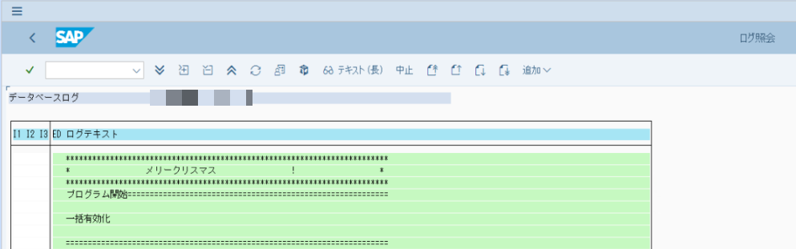
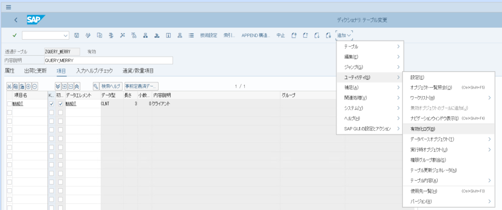
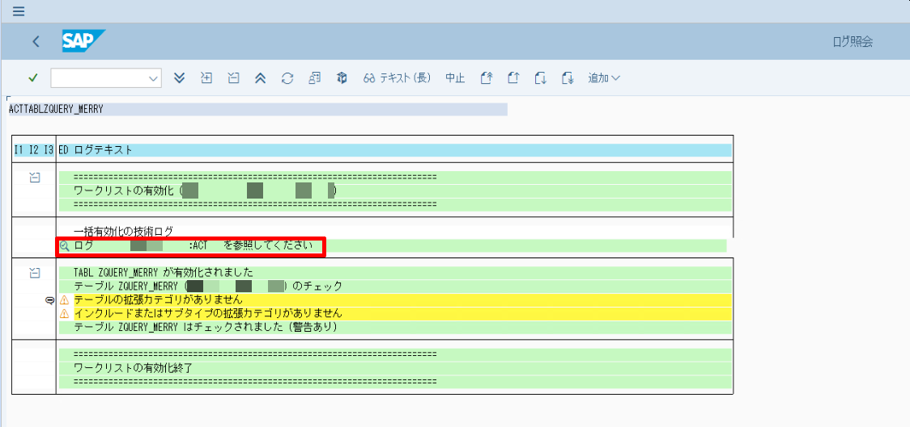
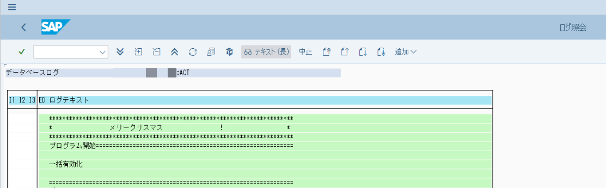
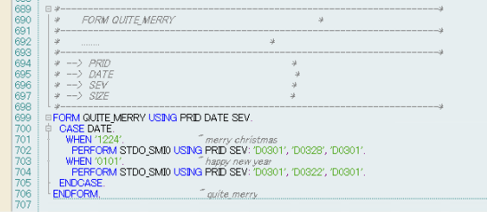
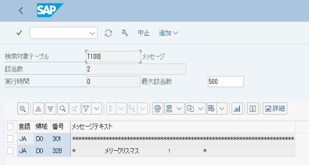
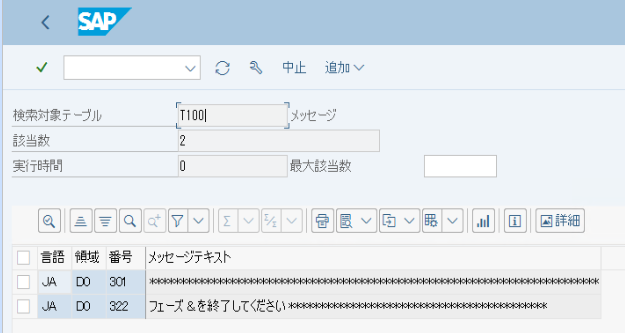
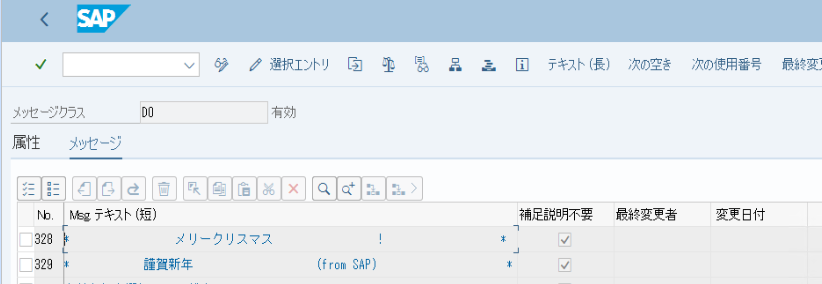

# 💎SAP QUITE_MERRY（イースターエッグ：メリークリスマス）

2019年、冬。

一部界隈でSAPのとある画面に仕込まれたイースターエッグが話題となっており。
久しぶりにこの話を聞いて懐かしい気分になったので一応まとめ。

イースタエッグについては下記、wikipedia参照。

[イースター・エッグ (コンピュータ)](https://ja.wikipedia.org/wiki/%E3%82%A4%E3%83%BC%E3%82%B9%E3%82%BF%E3%83%BC%E3%83%BB%E3%82%A8%E3%83%83%E3%82%B0_(%E3%82%B3%E3%83%B3%E3%83%94%E3%83%A5%E3%83%BC%E3%82%BF))

## 💎そもそもどんなイースターエッグ？

12月24日と01月01日に特殊なメッセージが表示されるイースターエッグです。



後述しますが、12月24日は上記のようにメリークリスマスと表示されますが。
1月1日の場合は、バグによって関係ないメッセージが表示されたりします。

## 💎メリークリスマスと表示してみる

ABAPディクショナリ（テーブルやらデータエレメントやら）の有効化ログにイースターエッグは仕込まれており。
12月24日もしくは1月1日にSE11等でオブジェクトの有効を実施し、ログを確認するとイースターエッグを見ることができます。

以下、適当なテーブルを12月24日に有効化してログ確認。

Note:12月24日にSE11にてテーブルの有効化を行い、ユーティリティ ー＞ 有効化ログ　を選択



Note:一括有効化の技術ログを開くために赤枠の行をダブルクリック。



Note:メリークリスマス!



こうなってくると他にも特殊な日付でなにか出るのでは？　と思いますよね。
探してみると1月1日も特殊なメッセージが用意されている事に気が付きます。

ただしこれはバグっていそうです……

## 💎1月1日はバグってる……

冒頭に記載しましたが、1月1日にもイースターエッグは用意されており特殊なメッセージが表示されます。
ただしこれは多分、バグってます……

このイースターエッグがどのように表示されているかと言えば。

プログラム：RADBTLO0中に下記のようなロジックが組まれています。



リテラルで1224と0101の日付。またD0301、D0328、D0322のメッセージが指定されています。

これはCASE文で指定された日付だったら、サブルーチン：STDO_SMI0にメッセージ番号を渡すような処理になっています。

なおサブルーチンSTDO_SMI0はsending data into a log channel(sとコメントに書かれているのでログ書き込みに使われるサブルーチンのようです。

更に言うとT100 message without parameterとも書かれておりパラメータのないメッセージ用のサブルーチン。

中をざっくりと読みましたが、そんな感じで間違いなさそうです

ですので12月24日だったらログにD0301とD0328が出力されそう。

テーブルT100でD0301とD0328を確認すると下記のようになっていました。



これを併せて考えると。

```
D0301 <- *************************************************************************
D0328 <- *                 メリークリスマス                 !                   *
D0301 <- *************************************************************************
```

のメッセージがログに出力されそうですよね？　メリークリスマス！
先程、12月24日に確認した通りのメッセージで、問題なさそうです。

では、1月1日の場合はどうかというと指定されているのはD0301とD0322。

テーブルT100のメッセージD0301とD0322を確認してみます。



……

```
D0301 <- *************************************************************************
D0322 <- フェーズ & を終了してください ******************************************
D0301 <- *************************************************************************
```

のメッセージが出力されそうです。(実際やるとこう出力されます）

……なんだかメリークリスマスと違って意味がわからない感じです。

サブルーチン、STDO_SMI0はT100 message without parameterなはずなのに、D0322にはパラメータ(&)がひとつ用意されています。

そもそものメッセージクラスD0を確認してみると、D0328(メリークリスマス)のひとつ下D0329に謹賀新年と登録されています。



これらを併せて推測となりますが、本来は1月1日の場合はD0329(謹賀新年)を表示させたかったが、誤ってD0322(フェーズを終了してください)を指定してしまっている気がします……すごい残念。

## 💎移送エラー？　したらでるって聞いたけど……

移送エラーしたらでると噂を聞いた事があります。
この噂って何かと言えば多分下記のような経緯で生じた噂な気がしています。

SAPの移送処理ではオブジェクトのインポートや有効化処理やログ記録を自動でやってくれる（すごい）。

なので、移送にABAPディクショナリオブジェクトが含まれている際に、自動で有効化処理までやってくれる。（すごい）

12月24日にそのようなオブジェクトを移送してエラーになった際に開発者はトランスポートログの確認をすると思います。

その一環として、トランスポートログ中の一つである、ABAPディクショナリの有効化　を確認します。
このイースターエッグに気づく！ ー＞　エラーで出た！（ように感じる）

という感じの体験を経る事によって、移送エラーをしたら出るらしいという噂が広まっているような気がします。

## 💎おまけ。SAPは多言語対応ですごい

ちなみにこのイースターエッグのメッセージ。

そもそも日本語が用意されているという事は他の言語も用意されているんじゃないか？　と気が付きます。

もちろん用意されています。

各言語インストールされていて、その言語で翻訳をされていれば、様々な言語でのSAPからの祝福メッセージを読むことができます。
（一部言語は用意されてなくて言語補足で英語とか入ってそうですけど）

ちなみに言語が完備されている事が保証されているドイツ語と英語では下記のような感じ。

```
ドイツ語
*                 SAP wünscht Ihnen eine frohe Weihnacht !              *
*            SAP wünscht Ihnen ein erfolgreiches neues Jahr !           *
英語
*                 SAP wishes you a Merry Christmas !                    *
*            SAP wishes you a successful New Year!                      *
```

日本語だとたんにメリークリスマスになってますが、元々はちょっと違いますね。

💎総評

SAPにイースタエッグがあるとか最初聞いた時はまさか！　とか思ったりしますが。
実際に目にすると、なるほどねーって感じ。

1月1日がバグってたりするのは少し残念ですけど。
